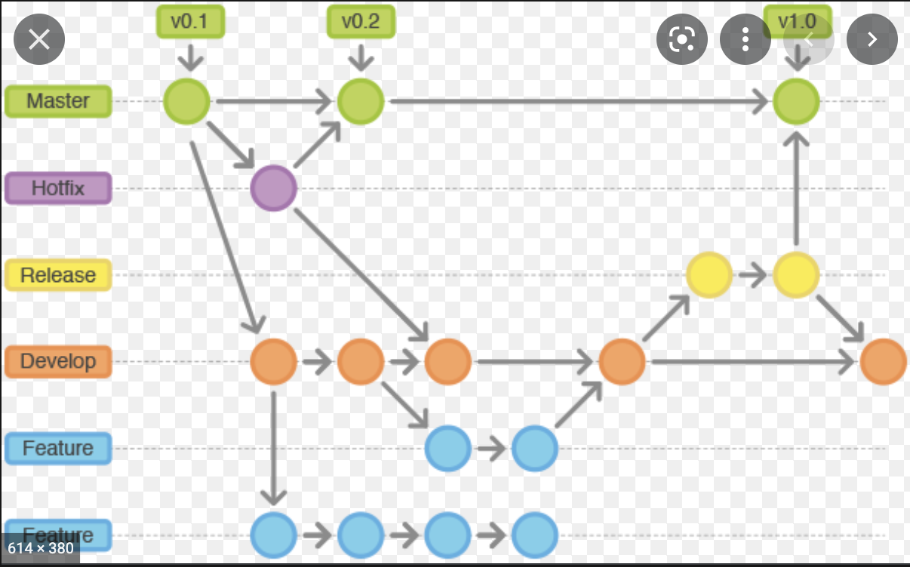

# Workflow

We're following the Feature-Driven Development workflow and the GitFlow standard.
Also, we're using the commit convention to keep a standard in our commits messages.

## Tasks documentation

Each task must be wrote in the Github Issues before being developed. There are 5 types of tasks:

- `chore/`: A task that won't affect the application's features
- `bug/`: A task that'll fix a bug
- `refactor/`: A task that is going to improve the software quality without affecting any feature behavior
- `docs/`: A task that is going to improve the documentation
- `test/`: A task that is going to improve the test coverage

Each one of the types has a respective label on Github Issues. Remember to assign one of the labels to the task, according to its goal.

## Branch management

Since we're using the Feature-Driven Development with GitFlow, you'll need to create a new branch for any new task being developed. There are different rules for the type of branch, as follows:

Our golden rule is on the branch name. It must follow the following pattern:

> `${label}/${id}-${lowercase-subtitle}`

Where:

- `${label}`: is the type of the task (the label assigned to the task on Github Issues).
- `${id}`: is the task's Github ID
- `${lowercase-subtitle}`: there's no rule for the subtitle, just write something short, in lowercase, and related to the branch goal

> Example: `docs/123456-create-readme`

## Deploying

After you've developed our task and you think it's ready to go, you must create a new pull-request. There are a few rules that you must follow:

- Your pull-request must be reviewed by 1 or more peer
- All items from the done criteria (see more below) must be checked
- Your pull-request must follow the GitFlow, as shown in the Branch Management topic

### Done criteria

As said before, your pull-request must check all items from the done criteria in order to be ready to be reviewed.

- [ ] The app's version was increased
- [ ] All the automated tests were run and are passing
- [ ] New tests were created in order to cover this branch's development (at least 60% od coverage)
- [ ] The documentation was updated
- [ ] I've provided every information required in order to review this pull-request
