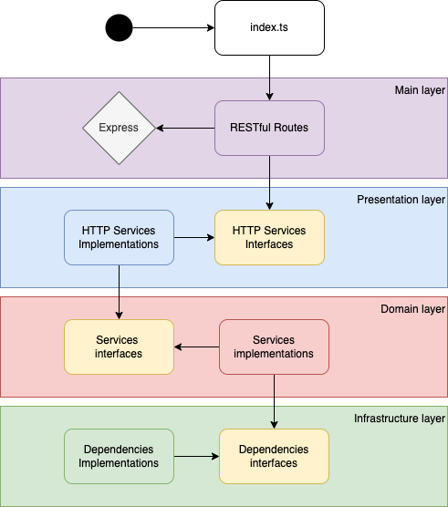

# Challenge back-end module

Back-end module created using Yarn and Typescript. All the typescript files must be placed inside of the `/src` folder. We're running ESLint to format our code style, following the AirBnb model. Also, we've set Prettier to be another formatter to our code style. It's rules are also set in the ESLint configuration.

Our application has automated tests using the Jest library. We aim to maintain at least 60% of code coverage. But, please, try to keep your work using TDD in order to improve ou maintainability.

# Environment setup

## Requirements

- Node 12.22.5+
- Yarn 1.22.5+

## Tools

- VS Code
- Git 2.31.0+

## Variables

Duplicate the `.env.example` file and rename it to `.env`. You'll need to set a few API Keys. The referral links are placed together with the env vars.

# Commands

- `build`: Build the application into the `/dist` folder
- `dev`: Compile and run the `/src/index.ts` file
- `test`: Run all the automated tests (files with `*.spec.ts`)
- `test:ci`: Run all automated tests and the code coverage

# Architecture

- `Infrastructure layer`: Layer responsible for defining the interfaces/contracts for all external dependencies, not-related to our business, but required in order to complete the work (as database, storage, etc)
- `Domain layer`: Layer responsible for all business-related services. Here is where our application REALLY lives in. All dependencies and external libraries are injected.
- `Presentation layer`: Layer responsible for injecting our domain services and transforming them into HTTP services.
- `Main layer`: Layer responsible for implementing the Express framework client and routes, injecting all HTTP services created in the presentation layer. The main layer is also responsible for the factories that make our services, applying the dependency injection.
- `index.ts`: Entrypoint of our server. Starts it and keep it running

# API

You can find out more about the available endpoints through the `/docs` endpoint. Run the API (`yarn dev`) and access the `/docs` endpoint. We're using the OpenAPI specification with the Swagger UI to automatically provide the endpoints documentation.
